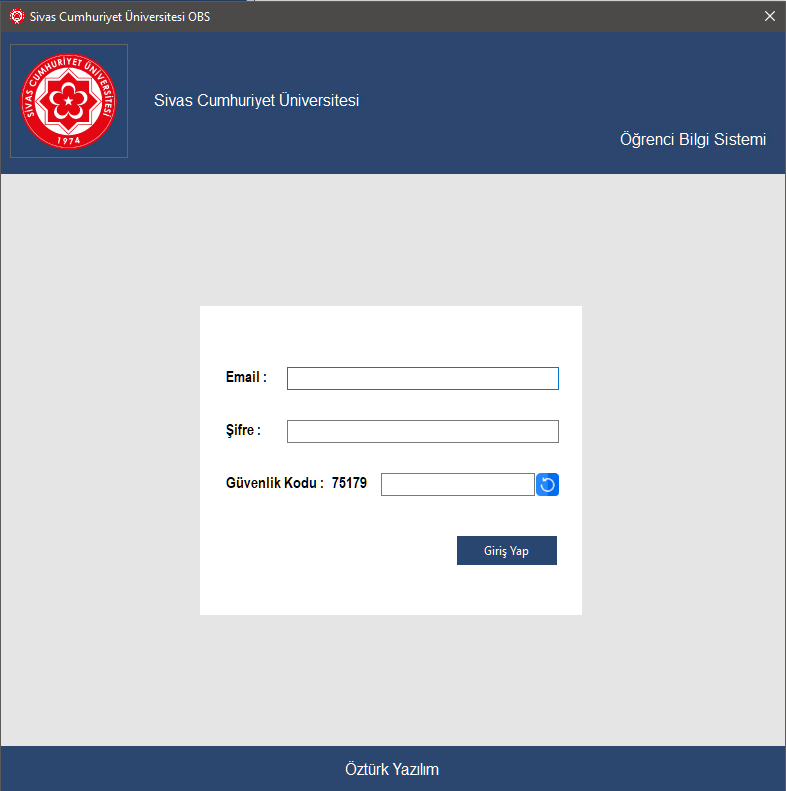
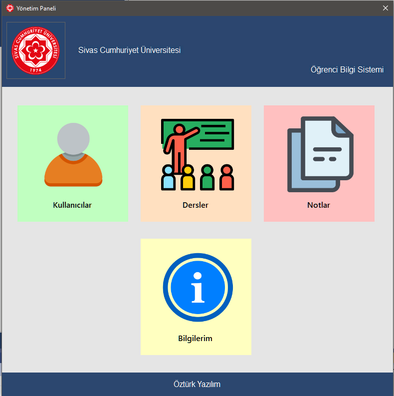
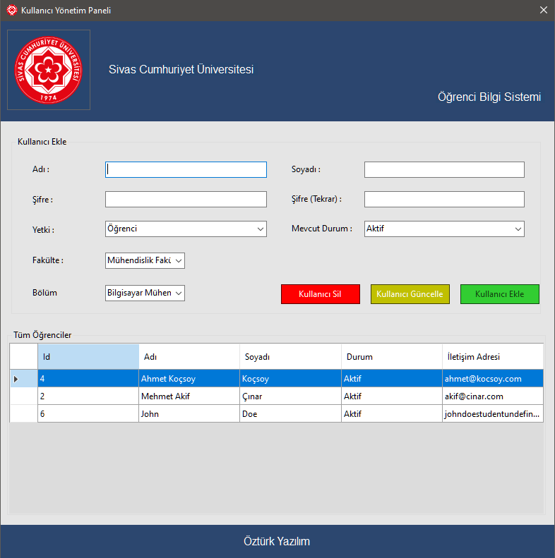
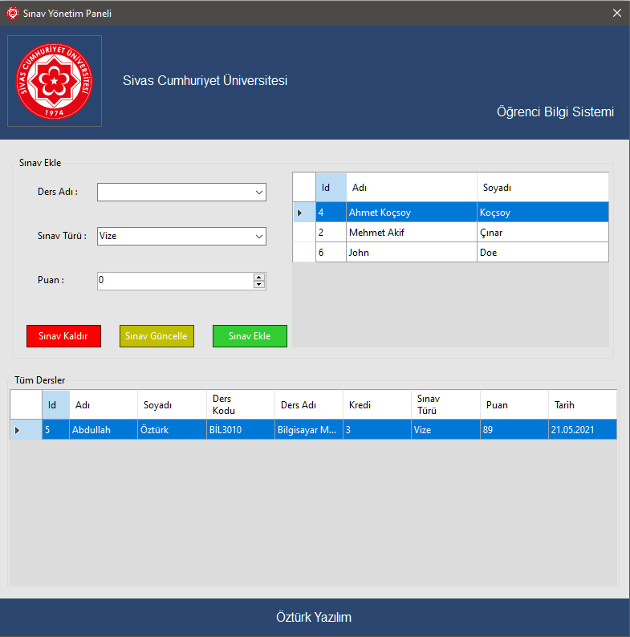
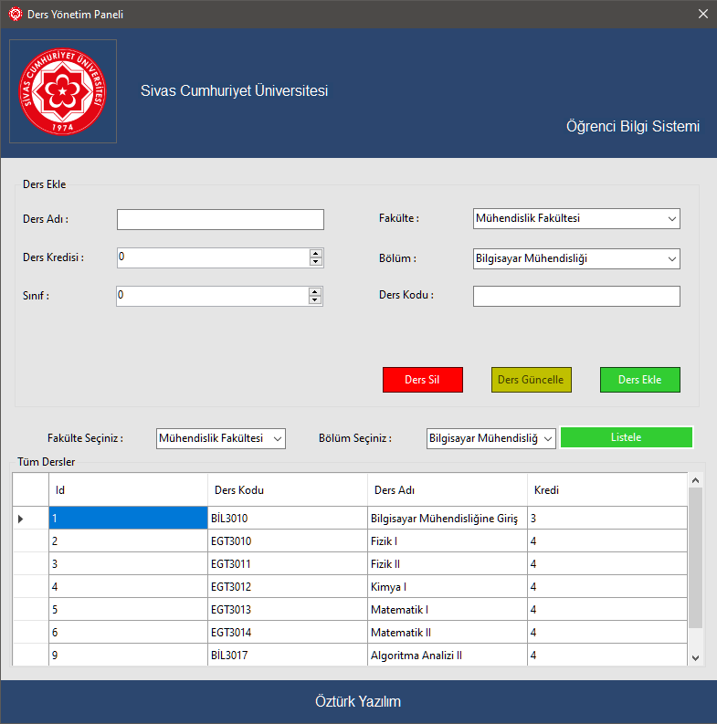

# University Management System Desktop UI

The project was developed based on the [University Management System backend](https://github.com/AbdullahOztuurkk/University-Management-System/).

This desktop application powered by .Net framework.

## Screenshots
<p>
  
</p>
<p>
  
  
  
  
</p>

### You can view all images in [public](./public) folder

# Features
- Sign In (Everyone) | Sign Up ( Only Admins)
- View your information

### Student
- List your own lessons
- List your own exams

### Teacher
- Create, delete or update exam 
- List your own exams

### Admins
- Create, delete or update all objects
- List all exams
- List all students
- List all lessons 
## Installation  

```bash 
  # Clone Repository
  git clone git@github.com:AbdullahOztuurkk/University-Management-System-Frontend.git
  cd University-Management-System-Frontend

  # Install all dependencies
  dotnet restore
```
    
## Used Technologies

- .NET Framework
- [RestSharp](https://github.com/restsharp/RestSharp)
- [Newtonsoft.Json](https://github.com/JamesNK/Newtonsoft.Json)

  